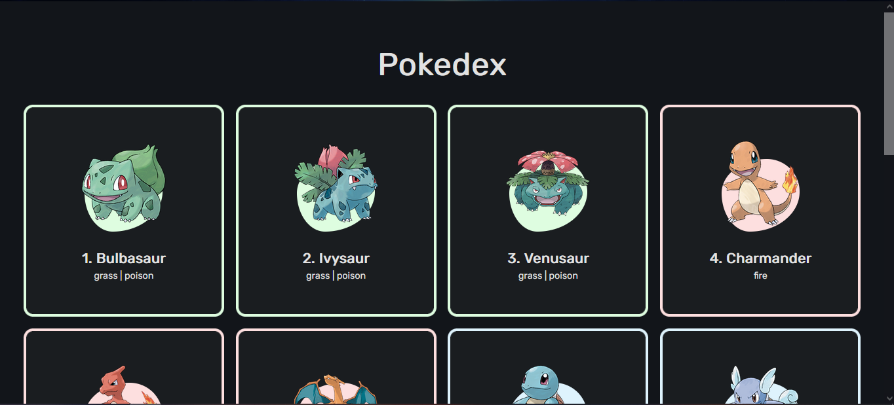

Pokédex com JavaScript puro

[Clique aqui para acessar](https://igormolinals.github.io/Pokedex-Javascript-Puro/)

Projeto de pokédex usando JavaScript puro (O HTML e CSS já prontos) construído durante a vídeo aula do professor Roger Melo. 
Nele desenvolvi tópicos avançados de JavaScript como enclausuramento, encapsulamento, boas práticas de programação, promises, async functions, DOMPurify e Intersection observers

Muito obrigado professor Roger pela aula! 

[Clique aqui para acessar a aula do professor!](https://www.youtube.com/watch?v=uTNKsgJHboo)
## Tecnologias

-JavaScript

## Contato
igoramil452@gmail.com
